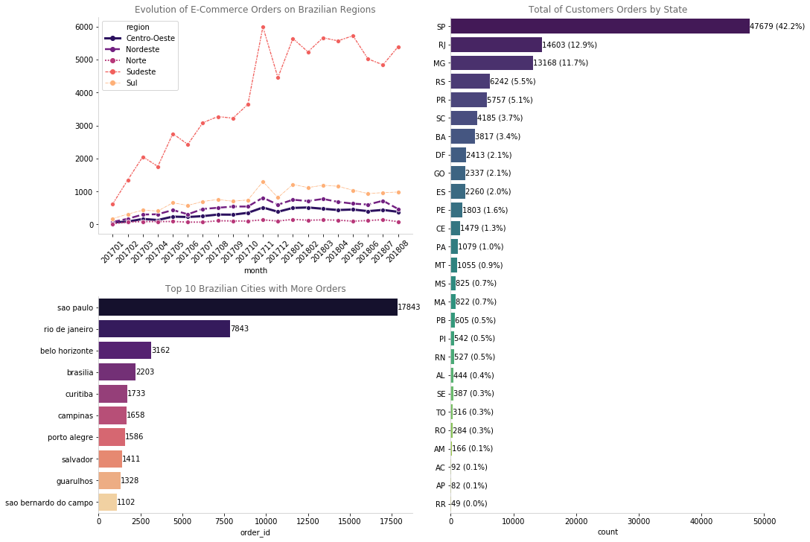

# PHÂN TÍCH HÀNH VI KHÁCH HÀNG - PROJECT CUỐI KỲ KHAI PHÁ DỮ LIỆU

## PHÂN TÍCH HÀNH VI NGƯỜI DÙNG

Trong bài toán này, nhóm chúng em đề xuất phương pháp phân khúc khách hàng với những đặc trưng riêng. Từ đó triển khai cá nhân hóa trải nghiệm mua sắm của khách hàng dựa trên hệ thống gợi ý sản phẩm. Và cuối cùng là phân tích cảm xúc của người dùng dựa trên phản hồi của họ, là cơ sở cho việc chăm sóc khách hàng tốt hơn, nâng cao, cải thiện dịch vụ doanh nghiệp cung cấp.

Việc hiểu khách hàng và đưa ra được những chiến lược marketing phù hợp là vô cùng quan trọng để tối đa doanh thu, tăng số lượng đơn đặt hàng cũng như khách hàng thân thiết, trung thành. 

## Các mục tiêu

1. Đầu tiên, quá trình xử lý và khai phá dữ liệu sẽ được tiến hành. Thông qua bước này, những hiểu biết về khách hàng sẽ được khai thác và trực quan hoá thành các đồ thị.
2. Sau đó, khách hàng sẽ được phân khúc thành các cụm cụ thể dựa trên RFM Modeling và sử dụng thuật toán K-Means dựa trên hành vi mua hàng của họ. 
3. Đề xuất sản phẩm cho khách hàng được cá nhân hóa dựa trên lịch sử mua hàng và phản hồi dưới dạng đánh giá sản phẩm của họ. Hệ thống sử dụng Alternative Least Squares (ALS) để cung cấp đề xuất cho từng người dùng.
4. Kế đó, quá trình phân tích cảm xúc của khách hàng thông qua đánh giá về sản phẩm sẽ diễn ra. Dựa vào đó, doanh nghiệp có thể cải thiện chất lượng sản phẩm hay dịch vụ chăm sóc khách hàng tốt hơn.
5. Giao diện Web được thiết kế để doanh nghiệp có cái nhìn rõ ràng, trực quan hơn.

## Đối tượng

1. Doanh nghiệp - Marketing Dashboard 
* Để có cái nhìn tổng quan về các phân tích và chỉ số doanh thu theo sản phẩm, ngày trong tuần và tháng. 
* Để xem xét tình hình thị trường, đề xuất chiến lược phù hợp cho doanh nghiệp.
* Phát huy những điểm mạnh và cải thiện những điểm yếu trong kinh doanh.

3. Khách hàng
* Được cá nhân hoá trải nghiệm mua sắm nhờ hệ thống gợi ý sản phẩm 
* Được phân khúc thành các nhóm và được nhận ưu đãi phù hợp.

# Hướng dẫn chạy

`git clone https://github.com/n1ml03/Project-Data-Mining.git`

`cd Project-Data-Mining`

`pip3 install -r requirements.txt`

### Download stemmer (OPEN IN NEW WINDOW)

`python3`

`import nltk`

`nltk.download('stopwords')`

`nltk.download('rslp')`

### Run project (RUN IN PREVIOUS WINDOW)

`cd 5.\ Streamlit\ Analytics\ Dashboard/webapp`

`streamlit run main.py`

